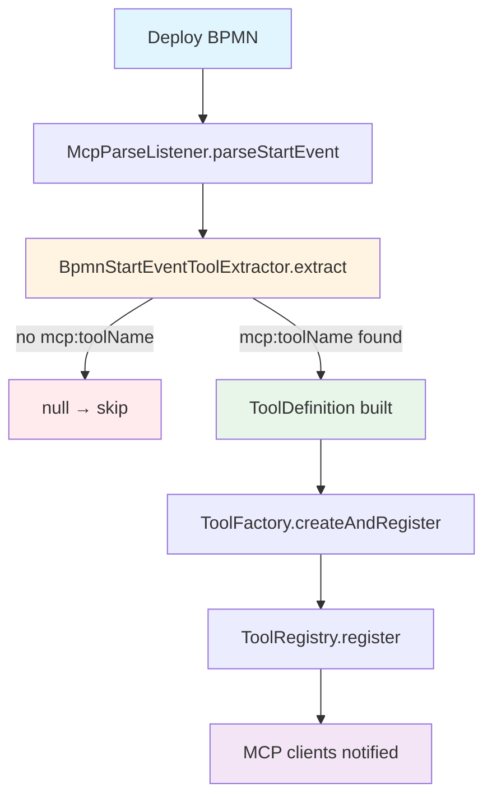
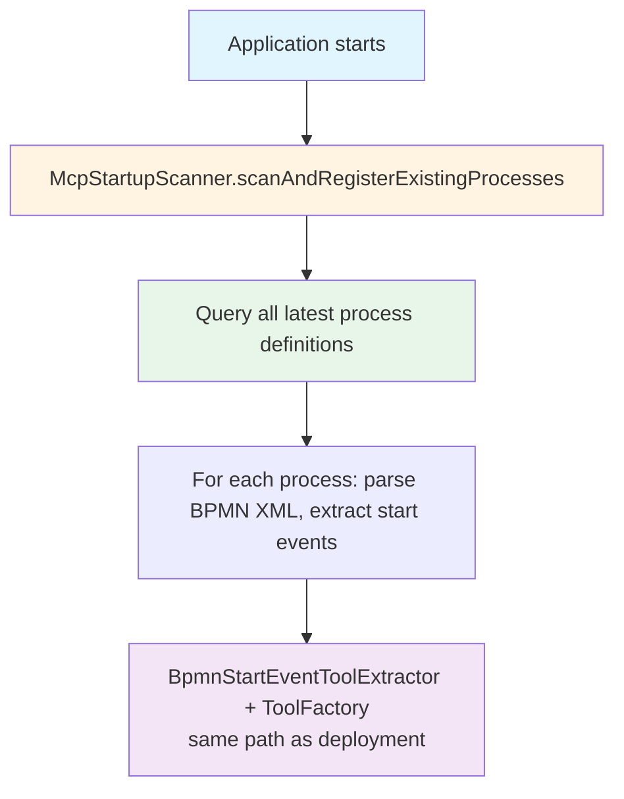
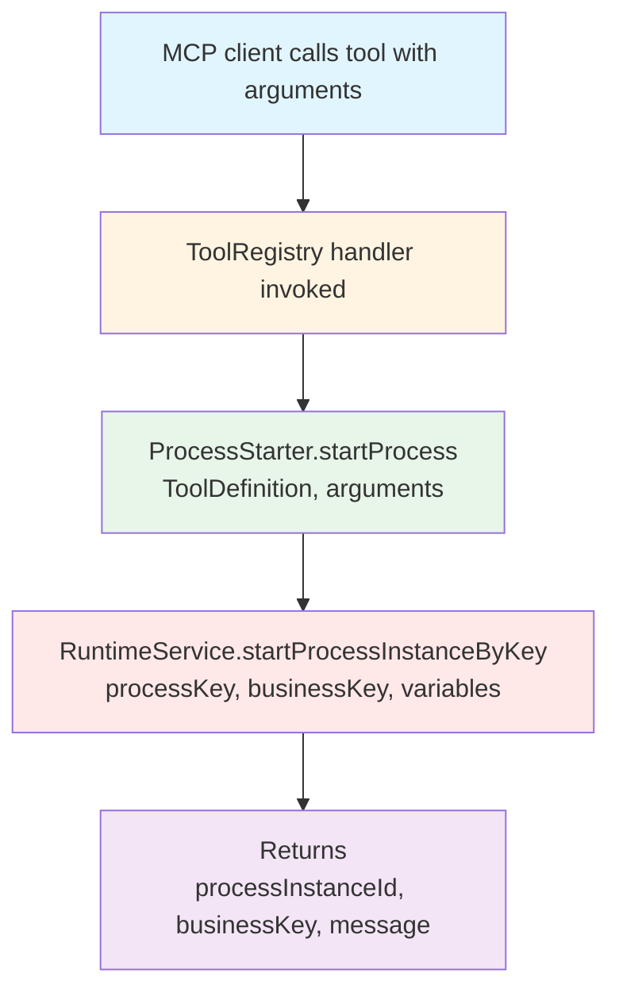

# mcp-process-start-event

A Fluxnova `ProcessEnginePlugin` that scans BPMN processes for MCP-annotated start events and exposes each one as an MCP tool via the [`mcp-server-plugin`](../mcp-server-plugin/README.md) `ToolRegistry`.

## Responsibilities

- Registers a BPMN parse listener that picks up `mcp:*` attributes on start events **at deployment time**
- Runs a startup scanner that registers tools for processes that were **already deployed** before the application started
- Translates BPMN start event metadata into `ToolConfig` objects and registers them in the `ToolRegistry`
- Starts a Fluxnova process instance when an MCP client invokes a tool

## Prerequisites

`mcp-server-plugin` must be on the classpath (and its `ToolRegistry` bean present) for this plugin to activate.

## Installation

### Spring Boot (auto-configuration)

```xml
<dependencies>
    <dependency>
        <groupId>org.finos.fluxnova.bpm</groupId>
        <artifactId>fluxnova-engine-plugins-ai-mcp-server</artifactId>
    </dependency>
    <dependency>
        <groupId>org.finos.fluxnova.bpm</groupId>
        <artifactId>fluxnova-engine-plugins-ai-mcp-start-event</artifactId>
    </dependency>
</dependencies>
```

Both plugins auto-configure. No additional setup required.

### Manual Fluxnova engine configuration

```xml

<bpm-platform xmlns="http://www.camunda.org/schema/1.0/BpmPlatform">
    <process-engine name="default">
        <plugins>
            <plugin>
                <class>
                    org.finos.fluxnova.ai.mcp.server.plugin.McpServerFluxnovaPlugin
                </class>
            </plugin>
            <plugin>
                <class>org.finos.fluxnova.ai.mcp.process.plugin.McpProcessStartEventPlugin</class>
            </plugin>
        </plugins>
    </process-engine>
</bpm-platform>
```

## BPMN Annotation Reference

Add MCP attributes to any `startEvent` element using the `mcp` namespace:

```
xmlns:mcp="http://fluxnova.finos.org/schema/1.0/ai/mcp"
```

### Attributes

| Attribute | Required | Description |
|-----------|----------|-------------|
| `mcp:toolName` | Yes      | Name exposed to the MCP client. Must be unique. |
| `mcp:description` | Yes      | Human-readable description shown to the AI. |
| `mcp:propagateBusinessKey` | No       | If `true`, adds a `businessKey` parameter to the tool. |

### Parameters

Declare input parameters inside `extensionElements`:

```xml
<extensionElements>
  <mcp:parameters>
    <mcp:parameter paramName="myParam" paramType="string"/>
  </mcp:parameters>
</extensionElements>
```

Supported `paramType` values: `string`, `number`, `boolean`, `object`, `array`

## Usage Examples

### Example 1 — Simple process trigger with business key

```xml
<?xml version="1.0" encoding="UTF-8"?>
<definitions xmlns="http://www.omg.org/spec/BPMN/20100524/MODEL"
             xmlns:mcp="http://fluxnova.finos.org/schema/1.0/ai/mcp"
             targetNamespace="http://example.org">

  <process id="expenseClaim" isExecutable="true">
    <startEvent id="start"
                mcp:toolName="SubmitExpenseClaim"
                mcp:description="Submits a new expense claim for management approval">
      <extensionElements>
        <mcp:parameters>
          <mcp:parameter paramName="claimantId"  paramType="string"/>
          <mcp:parameter paramName="amount"      paramType="number"/>
          <mcp:parameter paramName="description" paramType="string"/>
        </mcp:parameters>
      </extensionElements>
    </startEvent>
    <!-- ... rest of process ... -->
  </process>
</definitions>
```

An MCP client can now call `SubmitExpenseClaim` with:
```json
{
  "claimantId": "emp-42",
  "amount": 149.99,
  "description": "Client dinner",
  "businessKey": "EXP-2024-001"
}
```

The plugin starts the `expenseClaim` process and returns:
```json
{
  "processInstanceId": "abc123",
  "businessKey": "EXP-2024-001",
  "message": "Process started successfully"
}
```

---

### Example 2 — No business key propagation

```xml
<startEvent id="start"
            mcp:toolName="GenerateReport"
            mcp:description="Generates a scheduled analytics report"
            mcp:propagateBusinessKey="false">
  <extensionElements>
    <mcp:parameters>
      <mcp:parameter paramName="reportType" paramType="string"/>
      <mcp:parameter paramName="fromDate"   paramType="string"/>
      <mcp:parameter paramName="toDate"     paramType="string"/>
    </mcp:parameters>
  </extensionElements>
</startEvent>
```

MCP call:
```json
{
  "reportType": "monthly-sales",
  "fromDate": "2024-01-01",
  "toDate": "2024-01-31"
}
```

---

### Example 3 — Minimal annotation (no parameters)

```xml
<startEvent id="start"
            mcp:toolName="RunDailyCleanup"
            mcp:description="Triggers the daily data cleanup job"/>
```

MCP call:
```json
{
  "businessKey": "cleanup-2024-03-09"
}
```

---

## How It Works

### At deployment



### At startup (for pre-existing processes)



### When a tool is called by an MCP client



## Key Classes

| Class | Package | Role |
|-------|---------|------|
| `McpProcessStartEventPlugin` | `...process.plugin` | ProcessEnginePlugin entry point |
| `McpParseListener` | `...process.engine` | Intercepts BPMN parsing at deployment |
| `BpmnStartEventToolExtractor` | `...process.engine` | Reads `mcp:*` XML attributes |
| `ToolFactory` | `...process.engine` | Converts `ToolDefinition` → `ToolConfig` and registers it |
| `ProcessStarter` | `...process.engine` | Starts a process instance when a tool is invoked |
| `McpStartupScanner` | `...process.engine` | Registers tools for pre-existing processes at startup |
| `ToolDefinition` | `...process.model` | BPMN-derived tool descriptor |
| `ToolParameter` | `...process.model` | Single parameter descriptor |
| `McpProcessStartEventAutoConfiguration` | `...process.autoconfigure` | Spring Boot auto-configuration |
