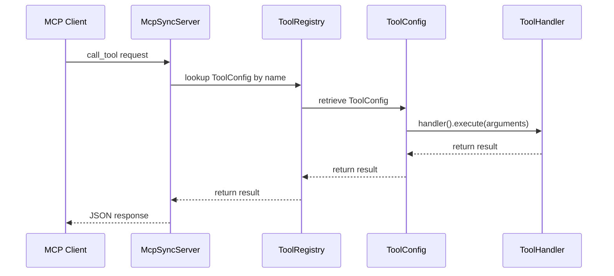

# mcp-server-plugin

A Fluxnova `ProcessEnginePlugin` that exposes the engine as an [MCP (Model Context Protocol)](https://modelcontextprotocol.io/) server. This plugin provides the foundational MCP server layer — primarily the `ToolRegistry` — that other plugins use to register callable tools.

## Responsibilities

- Starts and manages the Spring AI `McpSyncServer`
- Provides `ToolRegistry`, the shared API for registering and unregistering MCP tools
- Registers `FluxnovaMcpServerPlugin` with the Fluxnova engine lifecycle
- Notifies connected MCP clients when the tool list changes

This plugin has **no knowledge of BPMN processes**. It is a pure MCP server layer. For example, you can use [`mcp-process-start-event`](../mcp-process-start-event/README.md) to populate it with process-derived tools.

## Installation

### Spring Boot (auto-configuration)

Add the dependency. Auto-configuration activates automatically when `McpSyncServer` is on the classpath.

```xml
<dependency>
    <groupId>org.finos.fluxnova.bpm</groupId>
    <artifactId>fluxnova-engine-plugins-ai-mcp-server</artifactId>
</dependency>
```

### Manual Fluxnova engine configuration

```xml

<bpm-platform xmlns="http://www.camunda.org/schema/1.0/BpmPlatform">
    <process-engine name="default">
        <plugins>
            <plugin>
                <class>org.finos.fluxnova.ai.mcp.server.plugin.McpServerFluxnovaPlugin</class>
            </plugin>
        </plugins>
    </process-engine>
</bpm-platform>
```

## Registering a Custom Tool

Obtain the `ToolRegistry` bean and register any `ToolConfig`:

```java
@Autowired
private ToolRegistry toolRegistry;

public void registerMyTool() {
    ToolConfig config = new ToolConfig(
        "MyCustomTool",
        "Does something useful",
        Map.of(
            "input", ToolConfig.ParameterSpec.required("string"),
            "verbose", ToolConfig.ParameterSpec.optional("boolean")
        ),
        args -> {
            String input = (String) args.get("input");
            // ... execute business logic ...
            return Map.of("result", "processed: " + input);
        }
    );

    toolRegistry.register(config);
}
```

### Unregistering a tool

```java
toolRegistry.unregister("MyCustomTool");
```

### Checking registration state

```java
boolean active = toolRegistry.isRegistered("MyCustomTool");
int count = toolRegistry.getToolCount();
Set<String> names = toolRegistry.getRegisteredToolNames();
```
## MCP Server Plugin Startup Initialization Flow
```mermaid
flowchart TD
    A[Spring Boot Application starts] --> B[@AutoConfiguration triggers<br/>McpServerSpringAutoConfiguration]
    B --> C[@ConditionalOnClass checks:<br/>McpSyncServer present]
    B --> D[@ConditionalOnMissingBean<br/>checks]
    C --> E[Conditions met]
    D --> F[ToolRegistry bean created<br/>McpSyncServer + ObjectMapper]
    E --> G[Merge]
    F --> H[McpServerFluxnovaPlugin bean created<br/>ToolRegistry injected]
    H --> G
    G --> I[Fluxnova ProcessEngine initialization]
    I --> J[Plugin.preInit called]
    J --> K[LOG: MCP Server Plugin - Initializing]
    K --> L[Plugin.postInit called]
    L --> M[Plugin.postProcessEngineBuild called]
    M --> N[LOG: MCP Server Plugin ready - X tools registered]
    N --> O[ToolRegistry available for other plugins<br/>e.g., mcp-process-start-event]
    
    style A fill:#e1f5ff
    style B fill:#fff4e1
    style F fill:#e8f5e9
    style H fill:#e8f5e9
    style O fill:#f3e5f5
```
## Tool Execution Flow



## Configuration

The plugin activates automatically via Spring Boot auto-configuration. The underlying MCP server transport (SSE, stdio, WebMVC) is configured through standard Spring AI properties in `application.properties` / `application.yml`:

```yaml
# examples only, any valid Spring AI config will work
spring:
  ai:
    mcp:
      server:
        name: my-fluxnova-server
        version: 1.0.0
        protocol: streamable
        stdio: false
        type: sync
```

## Key Classes

| Class | Package | Role |
|-------|---------|------|
| `McpServerFluxnovaPlugin` | `...server.plugin` | ProcessEnginePlugin entry point |
| `ToolRegistry` | `...server.registry` | Register/unregister MCP tools |
| `ToolConfig` | `...server.registry` | Immutable tool descriptor |
| `ToolHandler` | `...server.model` | Functional interface for tool execution |
| `McpServerSpringAutoConfiguration` | `...server.autoconfigure` | Spring Boot auto-configuration |
